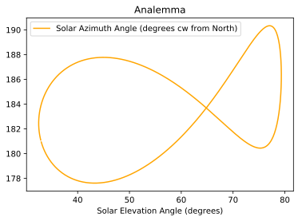
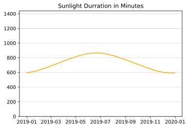
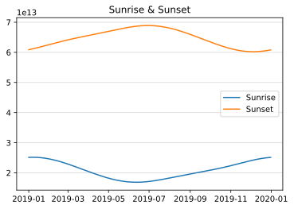
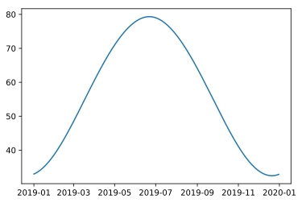

    import sunriset
    import datetime
    from datetime import timedelta
    import math
    import pytz
    
    import pandas as pd
    import matplotlib.pyplot as plt
    %config InlineBackend.figure_format = 'svg'

## Creating a Solar Calculations as a Pandas DataFrame using
`sunriset.to_pandas()`

    lat = 34.0522
    long = -118.2437
    local_tz = -8
    
    number_of_years = 1
    start_date = datetime.date(2019,1,1)
    
    df = sunriset.to_pandas(start_date, lat, long, local_tz, number_of_years)
    df

<table border="1" class="dataframe">
  <thead>
    <tr style="text-align: right;">
      <th></th>
      <th>Julian Day</th>
      <th>Julian Century</th>
      <th>Solar Geometric Mean Longitude</th>
      <th>Solar Geometric Mean Anomaly</th>
      <th>Eccentricity Earth Orbit</th>
      <th>Solar Equation of Center</th>
      <th>Solar True Longitude</th>
      <th>Solar True Anomaly</th>
      <th>Solar Radius Vector AUs</th>
      <th>Solar Apparent Longitude</th>
      <th>...</th>
      <th>Sunrise</th>
      <th>Sunset</th>
      <th>Sunlight Durration (minutes)</th>
      <th>Ture Solar Time</th>
      <th>Hour Angle Deg</th>
      <th>Solar Zenith Angle (degrees)</th>
      <th>Solar Elevation Angle (degrees)</th>
      <th>Approximate Atmospheric Refraction (degrees)</th>
      <th>Solar Elevation Corrected ATM Refraction (degrees)</th>
      <th>Solar Azimuth Angle (degrees cw from North)</th>
    </tr>
  </thead>
  <tbody>
    <tr>
      <th>2019-01-01</th>
      <td>2.458485e+06</td>
      <td>0.190016</td>
      <td>281.187700</td>
      <td>7197.923593</td>
      <td>0.016701</td>
      <td>-0.070815</td>
      <td>281.116885</td>
      <td>7197.852778</td>
      <td>0.983312</td>
      <td>281.106956</td>
      <td>...</td>
      <td>06:58:36.873548</td>
      <td>16:54:31.790164</td>
      <td>595.915277</td>
      <td>723.427802</td>
      <td>0.856951</td>
      <td>57.029271</td>
      <td>32.970729</td>
      <td>0.024808</td>
      <td>32.995537</td>
      <td>180.940464</td>
    </tr>
    <tr>
      <th>2019-01-02</th>
      <td>2.458486e+06</td>
      <td>0.190043</td>
      <td>282.173347</td>
      <td>7198.909193</td>
      <td>0.016701</td>
      <td>-0.037208</td>
      <td>282.136139</td>
      <td>7198.871986</td>
      <td>0.983303</td>
      <td>282.126208</td>
      <td>...</td>
      <td>06:58:47.452514</td>
      <td>16:55:17.182042</td>
      <td>596.495492</td>
      <td>722.961379</td>
      <td>0.740345</td>
      <td>56.939175</td>
      <td>33.060825</td>
      <td>0.024724</td>
      <td>33.085549</td>
      <td>180.813856</td>
    </tr>
    <tr>
      <th>2019-01-03</th>
      <td>2.458487e+06</td>
      <td>0.190071</td>
      <td>283.158994</td>
      <td>7199.894794</td>
      <td>0.016701</td>
      <td>-0.003589</td>
      <td>283.155405</td>
      <td>7199.891205</td>
      <td>0.983300</td>
      <td>283.145472</td>
      <td>...</td>
      <td>06:58:56.223129</td>
      <td>16:56:03.683546</td>
      <td>597.124340</td>
      <td>722.500778</td>
      <td>0.625194</td>
      <td>56.841714</td>
      <td>33.158286</td>
      <td>0.024633</td>
      <td>33.182918</td>
      <td>180.688520</td>
    </tr>
    <tr>
      <th>2019-01-04</th>
      <td>2.458488e+06</td>
      <td>0.190098</td>
      <td>284.144642</td>
      <td>7200.880394</td>
      <td>0.016701</td>
      <td>0.030031</td>
      <td>284.174673</td>
      <td>7200.910425</td>
      <td>0.983302</td>
      <td>284.164738</td>
      <td>...</td>
      <td>06:59:03.172873</td>
      <td>16:56:51.248578</td>
      <td>597.801262</td>
      <td>722.046488</td>
      <td>0.511622</td>
      <td>56.736931</td>
      <td>33.263069</td>
      <td>0.024535</td>
      <td>33.287604</td>
      <td>180.564547</td>
    </tr>
    <tr>
      <th>2019-01-05</th>
      <td>2.458489e+06</td>
      <td>0.190125</td>
      <td>285.130289</td>
      <td>7201.865994</td>
      <td>0.016701</td>
      <td>0.063642</td>
      <td>285.193931</td>
      <td>7201.929636</td>
      <td>0.983310</td>
      <td>285.183994</td>
      <td>...</td>
      <td>06:59:08.291028</td>
      <td>16:57:39.830550</td>
      <td>598.525659</td>
      <td>721.598987</td>
      <td>0.399747</td>
      <td>56.624867</td>
      <td>33.375133</td>
      <td>0.024431</td>
      <td>33.399564</td>
      <td>180.442023</td>
    </tr>
    <tr>
      <th>2019-01-06</th>
      <td>2.458490e+06</td>
      <td>0.190153</td>
      <td>286.115936</td>
      <td>7202.851594</td>
      <td>0.016701</td>
      <td>0.097232</td>
      <td>286.213169</td>
      <td>7202.948827</td>
      <td>0.983322</td>
      <td>286.203229</td>
      <td>...</td>
      <td>06:59:11.568661</td>
      <td>16:58:29.382487</td>
      <td>599.296897</td>
      <td>721.158740</td>
      <td>0.289685</td>
      <td>56.505571</td>
      <td>33.494429</td>
      <td>0.024321</td>
      <td>33.518750</td>
      <td>180.321037</td>
    </tr>
    <tr>
      <th>2019-01-07</th>
      <td>2.458491e+06</td>
      <td>0.190180</td>
      <td>287.101584</td>
      <td>7203.837195</td>
      <td>0.016701</td>
      <td>0.130792</td>
      <td>287.232376</td>
      <td>7203.967987</td>
      <td>0.983339</td>
      <td>287.222435</td>
      <td>...</td>
      <td>06:59:12.998611</td>
      <td>16:59:19.857122</td>
      <td>600.114309</td>
      <td>720.726202</td>
      <td>0.181551</td>
      <td>56.379092</td>
      <td>33.620908</td>
      <td>0.024206</td>
      <td>33.645114</td>
      <td>180.201677</td>
    </tr>
    <tr>
      <th>2019-01-08</th>
      <td>2.458492e+06</td>
      <td>0.190208</td>
      <td>288.087231</td>
      <td>7204.822795</td>
      <td>0.016701</td>
      <td>0.164311</td>
      <td>288.251542</td>
      <td>7204.987106</td>
      <td>0.983362</td>
      <td>288.241599</td>
      <td>...</td>
      <td>06:59:12.575466</td>
      <td>17:00:11.207005</td>
      <td>600.977192</td>
      <td>720.301813</td>
      <td>0.075453</td>
      <td>56.245483</td>
      <td>33.754517</td>
      <td>0.024084</td>
      <td>33.778602</td>
      <td>180.084028</td>
    </tr>
    <tr>
      <th>2019-01-09</th>
      <td>2.458493e+06</td>
      <td>0.190235</td>
      <td>289.072879</td>
      <td>7205.808395</td>
      <td>0.016701</td>
      <td>0.197777</td>
      <td>289.270656</td>
      <td>7206.006173</td>
      <td>0.983389</td>
      <td>289.260711</td>
      <td>...</td>
      <td>06:59:10.295543</td>
      <td>17:01:03.384596</td>
      <td>601.884818</td>
      <td>719.885999</td>
      <td>-0.028500</td>
      <td>56.104798</td>
      <td>33.895202</td>
      <td>0.023958</td>
      <td>33.919159</td>
      <td>179.968177</td>
    </tr>
    <tr>
      <th>2019-01-10</th>
      <td>2.458494e+06</td>
      <td>0.190262</td>
      <td>290.058526</td>
      <td>7206.793996</td>
      <td>0.016701</td>
      <td>0.231182</td>
      <td>290.289708</td>
      <td>7207.025178</td>
      <td>0.983422</td>
      <td>290.279761</td>
      <td>...</td>
      <td>06:59:06.156856</td>
      <td>17:01:56.342370</td>
      <td>602.836425</td>
      <td>719.479173</td>
      <td>-0.130207</td>
      <td>55.957098</td>
      <td>34.042902</td>
      <td>0.023825</td>
      <td>34.066728</td>
      <td>179.854207</td>
    </tr>
    <tr>
      <th>2019-01-11</th>
      <td>2.458495e+06</td>
      <td>0.190290</td>
      <td>291.044173</td>
      <td>7207.779596</td>
      <td>0.016701</td>
      <td>0.264514</td>
      <td>291.308687</td>
      <td>7208.044110</td>
      <td>0.983459</td>
      <td>291.298738</td>
      <td>...</td>
      <td>06:59:00.159088</td>
      <td>17:02:50.032917</td>
      <td>603.831230</td>
      <td>719.081733</td>
      <td>-0.229567</td>
      <td>55.802441</td>
      <td>34.197559</td>
      <td>0.023688</td>
      <td>34.221247</td>
      <td>179.742204</td>
    </tr>
    <tr>
      <th>2019-01-12</th>
      <td>2.458496e+06</td>
      <td>0.190317</td>
      <td>292.029821</td>
      <td>7208.765196</td>
      <td>0.016701</td>
      <td>0.297762</td>
      <td>292.327583</td>
      <td>7209.062958</td>
      <td>0.983502</td>
      <td>292.317632</td>
      <td>...</td>
      <td>06:58:52.303554</td>
      <td>17:03:44.409034</td>
      <td>604.868425</td>
      <td>718.694062</td>
      <td>-0.326485</td>
      <td>55.640894</td>
      <td>34.359106</td>
      <td>0.023546</td>
      <td>34.382652</td>
      <td>179.632250</td>
    </tr>
    <tr>
      <th>2019-01-13</th>
      <td>2.458497e+06</td>
      <td>0.190345</td>
      <td>293.015468</td>
      <td>7209.750796</td>
      <td>0.016701</td>
      <td>0.330917</td>
      <td>293.346385</td>
      <td>7210.081713</td>
      <td>0.983550</td>
      <td>293.336432</td>
      <td>...</td>
      <td>06:58:42.593171</td>
      <td>17:04:39.423828</td>
      <td>605.947178</td>
      <td>718.316525</td>
      <td>-0.420869</td>
      <td>55.472520</td>
      <td>34.527480</td>
      <td>0.023399</td>
      <td>34.550878</td>
      <td>179.524427</td>
    </tr>
    <tr>
      <th>2019-01-14</th>
      <td>2.458498e+06</td>
      <td>0.190372</td>
      <td>294.001115</td>
      <td>7210.736397</td>
      <td>0.016701</td>
      <td>0.363967</td>
      <td>294.365083</td>
      <td>7211.100364</td>
      <td>0.983603</td>
      <td>294.355127</td>
      <td>...</td>
      <td>06:58:31.032415</td>
      <td>17:05:35.030804</td>
      <td>607.066640</td>
      <td>717.949473</td>
      <td>-0.512632</td>
      <td>55.297391</td>
      <td>34.702609</td>
      <td>0.023247</td>
      <td>34.725856</td>
      <td>179.418817</td>
    </tr>
    <tr>
      <th>2019-01-15</th>
      <td>2.458499e+06</td>
      <td>0.190399</td>
      <td>294.986763</td>
      <td>7211.721997</td>
      <td>0.016701</td>
      <td>0.396903</td>
      <td>295.383666</td>
      <td>7212.118900</td>
      <td>0.983660</td>
      <td>295.373709</td>
      <td>...</td>
      <td>06:58:17.627281</td>
      <td>17:06:31.183957</td>
      <td>608.225945</td>
      <td>717.593240</td>
      <td>-0.601690</td>
      <td>55.115576</td>
      <td>34.884424</td>
      <td>0.023091</td>
      <td>34.907515</td>
      <td>179.315499</td>
    </tr>
    <tr>
      <th>2019-01-16</th>
      <td>2.458500e+06</td>
      <td>0.190427</td>
      <td>295.972410</td>
      <td>7212.707597</td>
      <td>0.016701</td>
      <td>0.429714</td>
      <td>296.402124</td>
      <td>7213.137312</td>
      <td>0.983723</td>
      <td>296.392165</td>
      <td>...</td>
      <td>06:58:02.385242</td>
      <td>17:07:27.837863</td>
      <td>609.424210</td>
      <td>717.248141</td>
      <td>-0.687965</td>
      <td>54.927151</td>
      <td>35.072849</td>
      <td>0.022930</td>
      <td>35.095780</td>
      <td>179.214551</td>
    </tr>
    <tr>
      <th>2019-01-17</th>
      <td>2.458501e+06</td>
      <td>0.190454</td>
      <td>296.958057</td>
      <td>7213.693198</td>
      <td>0.016701</td>
      <td>0.462390</td>
      <td>297.420448</td>
      <td>7214.155588</td>
      <td>0.983791</td>
      <td>297.410486</td>
      <td>...</td>
      <td>06:57:45.315205</td>
      <td>17:08:24.947759</td>
      <td>610.660543</td>
      <td>716.914475</td>
      <td>-0.771381</td>
      <td>54.732190</td>
      <td>35.267810</td>
      <td>0.022766</td>
      <td>35.290576</td>
      <td>179.116053</td>
    </tr>
    <tr>
      <th>2019-01-18</th>
      <td>2.458502e+06</td>
      <td>0.190481</td>
      <td>297.943705</td>
      <td>7214.678798</td>
      <td>0.016701</td>
      <td>0.494921</td>
      <td>298.438625</td>
      <td>7215.173719</td>
      <td>0.983864</td>
      <td>298.428662</td>
      <td>...</td>
      <td>06:57:26.427466</td>
      <td>17:09:22.469627</td>
      <td>611.934036</td>
      <td>716.592524</td>
      <td>-0.851869</td>
      <td>54.530773</td>
      <td>35.469227</td>
      <td>0.022598</td>
      <td>35.491825</td>
      <td>179.020079</td>
    </tr>
    <tr>
      <th>2019-01-19</th>
      <td>2.458503e+06</td>
      <td>0.190509</td>
      <td>298.929352</td>
      <td>7215.664398</td>
      <td>0.016701</td>
      <td>0.527296</td>
      <td>299.456648</td>
      <td>7216.191694</td>
      <td>0.983941</td>
      <td>299.446682</td>
      <td>...</td>
      <td>06:57:05.733665</td>
      <td>17:10:20.360271</td>
      <td>613.243777</td>
      <td>716.282551</td>
      <td>-0.929362</td>
      <td>54.322981</td>
      <td>35.677019</td>
      <td>0.022426</td>
      <td>35.699446</td>
      <td>178.926705</td>
    </tr>
    <tr>
      <th>2019-01-20</th>
      <td>2.458504e+06</td>
      <td>0.190536</td>
      <td>299.915000</td>
      <td>7216.649998</td>
      <td>0.016701</td>
      <td>0.559505</td>
      <td>300.474504</td>
      <td>7217.209503</td>
      <td>0.984024</td>
      <td>300.464537</td>
      <td>...</td>
      <td>06:56:43.246736</td>
      <td>17:11:18.577389</td>
      <td>614.588844</td>
      <td>715.984799</td>
      <td>-1.003800</td>
      <td>54.108895</td>
      <td>35.891105</td>
      <td>0.022251</td>
      <td>35.913356</td>
      <td>178.836004</td>
    </tr>
    <tr>
      <th>2019-01-21</th>
      <td>2.458505e+06</td>
      <td>0.190564</td>
      <td>300.900647</td>
      <td>7217.635599</td>
      <td>0.016701</td>
      <td>0.591538</td>
      <td>301.492185</td>
      <td>7218.227136</td>
      <td>0.984111</td>
      <td>301.482216</td>
      <td>...</td>
      <td>06:56:18.980864</td>
      <td>17:12:17.079641</td>
      <td>615.968313</td>
      <td>715.699496</td>
      <td>-1.075126</td>
      <td>53.888603</td>
      <td>36.111397</td>
      <td>0.022073</td>
      <td>36.133470</td>
      <td>178.748049</td>
    </tr>
    <tr>
      <th>2019-01-22</th>
      <td>2.458506e+06</td>
      <td>0.190591</td>
      <td>301.886294</td>
      <td>7218.621199</td>
      <td>0.016701</td>
      <td>0.623385</td>
      <td>302.509679</td>
      <td>7219.244584</td>
      <td>0.984204</td>
      <td>302.499708</td>
      <td>...</td>
      <td>06:55:52.951434</td>
      <td>17:13:15.826716</td>
      <td>617.381255</td>
      <td>715.426849</td>
      <td>-1.143288</td>
      <td>53.662190</td>
      <td>36.337810</td>
      <td>0.021891</td>
      <td>36.359702</td>
      <td>178.662910</td>
    </tr>
    <tr>
      <th>2019-01-23</th>
      <td>2.458507e+06</td>
      <td>0.190618</td>
      <td>302.871942</td>
      <td>7219.606799</td>
      <td>0.016701</td>
      <td>0.655037</td>
      <td>303.526979</td>
      <td>7220.261836</td>
      <td>0.984301</td>
      <td>303.517005</td>
      <td>...</td>
      <td>06:55:25.174984</td>
      <td>17:14:14.779391</td>
      <td>618.826740</td>
      <td>715.167047</td>
      <td>-1.208238</td>
      <td>53.429745</td>
      <td>36.570255</td>
      <td>0.021707</td>
      <td>36.591962</td>
      <td>178.580655</td>
    </tr>
    <tr>
      <th>2019-01-24</th>
      <td>2.458508e+06</td>
      <td>0.190646</td>
      <td>303.857589</td>
      <td>7220.592399</td>
      <td>0.016701</td>
      <td>0.686483</td>
      <td>304.544072</td>
      <td>7221.278882</td>
      <td>0.984403</td>
      <td>304.534097</td>
      <td>...</td>
      <td>06:54:55.669160</td>
      <td>17:15:13.899584</td>
      <td>620.303840</td>
      <td>714.920260</td>
      <td>-1.269935</td>
      <td>53.191360</td>
      <td>36.808640</td>
      <td>0.021520</td>
      <td>36.830160</td>
      <td>178.501354</td>
    </tr>
    <tr>
      <th>2019-01-25</th>
      <td>2.458509e+06</td>
      <td>0.190673</td>
      <td>304.843236</td>
      <td>7221.578000</td>
      <td>0.016701</td>
      <td>0.717714</td>
      <td>305.560950</td>
      <td>7222.295713</td>
      <td>0.984509</td>
      <td>305.550973</td>
      <td>...</td>
      <td>06:54:24.452662</td>
      <td>17:16:13.150410</td>
      <td>621.811629</td>
      <td>714.686641</td>
      <td>-1.328340</td>
      <td>52.947128</td>
      <td>37.052872</td>
      <td>0.021331</td>
      <td>37.074203</td>
      <td>178.425070</td>
    </tr>
    <tr>
      <th>2019-01-26</th>
      <td>2.458510e+06</td>
      <td>0.190700</td>
      <td>305.828884</td>
      <td>7222.563600</td>
      <td>0.016701</td>
      <td>0.748719</td>
      <td>306.577603</td>
      <td>7223.312319</td>
      <td>0.984621</td>
      <td>306.567624</td>
      <td>...</td>
      <td>06:53:51.545201</td>
      <td>17:17:12.496218</td>
      <td>623.349184</td>
      <td>714.466322</td>
      <td>-1.383420</td>
      <td>52.697142</td>
      <td>37.302858</td>
      <td>0.021139</td>
      <td>37.323997</td>
      <td>178.351868</td>
    </tr>
    <tr>
      <th>2019-01-27</th>
      <td>2.458511e+06</td>
      <td>0.190728</td>
      <td>306.814531</td>
      <td>7223.549200</td>
      <td>0.016701</td>
      <td>0.779490</td>
      <td>307.594021</td>
      <td>7224.328690</td>
      <td>0.984737</td>
      <td>307.584040</td>
      <td>...</td>
      <td>06:53:16.967450</td>
      <td>17:18:11.902641</td>
      <td>624.915587</td>
      <td>714.259416</td>
      <td>-1.435146</td>
      <td>52.441500</td>
      <td>37.558500</td>
      <td>0.020946</td>
      <td>37.579446</td>
      <td>178.281810</td>
    </tr>
    <tr>
      <th>2019-01-28</th>
      <td>2.458512e+06</td>
      <td>0.190755</td>
      <td>307.800178</td>
      <td>7224.534801</td>
      <td>0.016701</td>
      <td>0.810016</td>
      <td>308.610195</td>
      <td>7225.344817</td>
      <td>0.984858</td>
      <td>308.600212</td>
      <td>...</td>
      <td>06:52:40.740997</td>
      <td>17:19:11.336626</td>
      <td>626.509927</td>
      <td>714.066020</td>
      <td>-1.483495</td>
      <td>52.180299</td>
      <td>37.819701</td>
      <td>0.020750</td>
      <td>37.840451</td>
      <td>178.214958</td>
    </tr>
    <tr>
      <th>2019-01-29</th>
      <td>2.458513e+06</td>
      <td>0.190783</td>
      <td>308.785826</td>
      <td>7225.520401</td>
      <td>0.016701</td>
      <td>0.840289</td>
      <td>309.626115</td>
      <td>7226.360690</td>
      <td>0.984983</td>
      <td>309.616130</td>
      <td>...</td>
      <td>06:52:02.888300</td>
      <td>17:20:10.766467</td>
      <td>628.131303</td>
      <td>713.886210</td>
      <td>-1.528447</td>
      <td>51.913639</td>
      <td>38.086361</td>
      <td>0.020552</td>
      <td>38.106914</td>
      <td>178.151368</td>
    </tr>
    <tr>
      <th>2019-01-30</th>
      <td>2.458514e+06</td>
      <td>0.190810</td>
      <td>309.771473</td>
      <td>7226.506001</td>
      <td>0.016701</td>
      <td>0.870299</td>
      <td>310.641772</td>
      <td>7227.376300</td>
      <td>0.985113</td>
      <td>310.631785</td>
      <td>...</td>
      <td>06:51:23.432639</td>
      <td>17:21:10.161831</td>
      <td>629.778820</td>
      <td>713.720046</td>
      <td>-1.569988</td>
      <td>51.641621</td>
      <td>38.358379</td>
      <td>0.020353</td>
      <td>38.378733</td>
      <td>178.091098</td>
    </tr>
    <tr>
      <th>...</th>
      <td>...</td>
      <td>...</td>
      <td>...</td>
      <td>...</td>
      <td>...</td>
      <td>...</td>
      <td>...</td>
      <td>...</td>
      <td>...</td>
      <td>...</td>
      <td>...</td>
      <td>...</td>
      <td>...</td>
      <td>...</td>
      <td>...</td>
      <td>...</td>
      <td>...</td>
      <td>...</td>
      <td>...</td>
      <td>...</td>
      <td>...</td>
    </tr>
    <tr>
      <th>2019-12-02</th>
      <td>2.458820e+06</td>
      <td>0.199188</td>
      <td>251.379566</td>
      <td>7528.099687</td>
      <td>0.016700</td>
      <td>-1.029459</td>
      <td>250.350107</td>
      <td>7527.070228</td>
      <td>0.985903</td>
      <td>250.339707</td>
      <td>...</td>
      <td>06:41:17.094732</td>
      <td>16:43:32.038590</td>
      <td>602.249064</td>
      <td>737.590556</td>
      <td>4.397639</td>
      <td>56.204329</td>
      <td>33.795671</td>
      <td>0.024047</td>
      <td>33.819719</td>
      <td>184.907806</td>
    </tr>
    <tr>
      <th>2019-12-03</th>
      <td>2.458821e+06</td>
      <td>0.199215</td>
      <td>252.365214</td>
      <td>7529.085287</td>
      <td>0.016700</td>
      <td>-1.001051</td>
      <td>251.364162</td>
      <td>7528.084236</td>
      <td>0.985749</td>
      <td>251.353761</td>
      <td>...</td>
      <td>06:42:08.254820</td>
      <td>16:43:27.965059</td>
      <td>601.328504</td>
      <td>737.198168</td>
      <td>4.299542</td>
      <td>56.339841</td>
      <td>33.660159</td>
      <td>0.024170</td>
      <td>33.684329</td>
      <td>184.785840</td>
    </tr>
    <tr>
      <th>2019-12-04</th>
      <td>2.458822e+06</td>
      <td>0.199243</td>
      <td>253.350861</td>
      <td>7530.070887</td>
      <td>0.016700</td>
      <td>-0.972331</td>
      <td>252.378530</td>
      <td>7529.098556</td>
      <td>0.985599</td>
      <td>252.368128</td>
      <td>...</td>
      <td>06:42:58.684867</td>
      <td>16:43:25.788877</td>
      <td>600.451734</td>
      <td>736.796052</td>
      <td>4.199013</td>
      <td>56.468277</td>
      <td>33.531723</td>
      <td>0.024287</td>
      <td>33.556010</td>
      <td>184.662404</td>
    </tr>
    <tr>
      <th>2019-12-05</th>
      <td>2.458823e+06</td>
      <td>0.199270</td>
      <td>254.336508</td>
      <td>7531.056488</td>
      <td>0.016700</td>
      <td>-0.943307</td>
      <td>253.393202</td>
      <td>7530.113181</td>
      <td>0.985453</td>
      <td>253.382799</td>
      <td>...</td>
      <td>06:43:48.337345</td>
      <td>16:43:25.508393</td>
      <td>599.619517</td>
      <td>736.384619</td>
      <td>4.096155</td>
      <td>56.589581</td>
      <td>33.410419</td>
      <td>0.024399</td>
      <td>33.434818</td>
      <td>184.537581</td>
    </tr>
    <tr>
      <th>2019-12-06</th>
      <td>2.458824e+06</td>
      <td>0.199297</td>
      <td>255.322156</td>
      <td>7532.042088</td>
      <td>0.016700</td>
      <td>-0.913988</td>
      <td>254.408168</td>
      <td>7531.128100</td>
      <td>0.985312</td>
      <td>254.397764</td>
      <td>...</td>
      <td>06:44:37.164681</td>
      <td>16:43:27.120262</td>
      <td>598.832593</td>
      <td>735.964292</td>
      <td>3.991073</td>
      <td>56.703702</td>
      <td>33.296298</td>
      <td>0.024504</td>
      <td>33.320802</td>
      <td>184.411460</td>
    </tr>
    <tr>
      <th>2019-12-07</th>
      <td>2.458825e+06</td>
      <td>0.199325</td>
      <td>256.307803</td>
      <td>7533.027688</td>
      <td>0.016700</td>
      <td>-0.884383</td>
      <td>255.423420</td>
      <td>7532.143305</td>
      <td>0.985176</td>
      <td>255.413016</td>
      <td>...</td>
      <td>06:45:25.119357</td>
      <td>16:43:30.619428</td>
      <td>598.091668</td>
      <td>735.535510</td>
      <td>3.883878</td>
      <td>56.810590</td>
      <td>33.189410</td>
      <td>0.024603</td>
      <td>33.214014</td>
      <td>184.284127</td>
    </tr>
    <tr>
      <th>2019-12-08</th>
      <td>2.458826e+06</td>
      <td>0.199352</td>
      <td>257.293451</td>
      <td>7534.013289</td>
      <td>0.016700</td>
      <td>-0.854502</td>
      <td>256.438949</td>
      <td>7533.158787</td>
      <td>0.985044</td>
      <td>256.428544</td>
      <td>...</td>
      <td>06:46:12.154010</td>
      <td>16:43:35.999089</td>
      <td>597.397418</td>
      <td>735.098724</td>
      <td>3.774681</td>
      <td>56.910199</td>
      <td>33.089801</td>
      <td>0.024697</td>
      <td>33.114498</td>
      <td>184.155671</td>
    </tr>
    <tr>
      <th>2019-12-09</th>
      <td>2.458827e+06</td>
      <td>0.199379</td>
      <td>258.279098</td>
      <td>7534.998889</td>
      <td>0.016700</td>
      <td>-0.824353</td>
      <td>257.454745</td>
      <td>7534.174536</td>
      <td>0.984917</td>
      <td>257.444339</td>
      <td>...</td>
      <td>06:46:58.221537</td>
      <td>16:43:43.250684</td>
      <td>596.750486</td>
      <td>734.654398</td>
      <td>3.663600</td>
      <td>57.002485</td>
      <td>32.997515</td>
      <td>0.024783</td>
      <td>33.022298</td>
      <td>184.026180</td>
    </tr>
    <tr>
      <th>2019-12-10</th>
      <td>2.458828e+06</td>
      <td>0.199407</td>
      <td>259.264745</td>
      <td>7535.984489</td>
      <td>0.016700</td>
      <td>-0.793946</td>
      <td>258.470799</td>
      <td>7535.190543</td>
      <td>0.984794</td>
      <td>258.460393</td>
      <td>...</td>
      <td>06:47:43.275195</td>
      <td>16:43:52.363873</td>
      <td>596.151478</td>
      <td>734.203008</td>
      <td>3.550752</td>
      <td>57.087409</td>
      <td>32.912591</td>
      <td>0.024863</td>
      <td>32.937454</td>
      <td>183.895743</td>
    </tr>
    <tr>
      <th>2019-12-11</th>
      <td>2.458829e+06</td>
      <td>0.199434</td>
      <td>260.250393</td>
      <td>7536.970089</td>
      <td>0.016700</td>
      <td>-0.763290</td>
      <td>259.487102</td>
      <td>7536.206799</td>
      <td>0.984675</td>
      <td>259.476695</td>
      <td>...</td>
      <td>06:48:27.268702</td>
      <td>16:44:03.326524</td>
      <td>595.600964</td>
      <td>733.745040</td>
      <td>3.436260</td>
      <td>57.164932</td>
      <td>32.835068</td>
      <td>0.024937</td>
      <td>32.860005</td>
      <td>183.764452</td>
    </tr>
    <tr>
      <th>2019-12-12</th>
      <td>2.458830e+06</td>
      <td>0.199462</td>
      <td>261.236040</td>
      <td>7537.955690</td>
      <td>0.016700</td>
      <td>-0.732395</td>
      <td>260.503645</td>
      <td>7537.223295</td>
      <td>0.984562</td>
      <td>260.493237</td>
      <td>...</td>
      <td>06:49:10.156340</td>
      <td>16:44:16.124705</td>
      <td>595.099473</td>
      <td>733.280991</td>
      <td>3.320248</td>
      <td>57.235021</td>
      <td>32.764979</td>
      <td>0.025004</td>
      <td>32.789983</td>
      <td>183.632395</td>
    </tr>
    <tr>
      <th>2019-12-13</th>
      <td>2.458831e+06</td>
      <td>0.199489</td>
      <td>262.221687</td>
      <td>7538.941290</td>
      <td>0.016700</td>
      <td>-0.701270</td>
      <td>261.520417</td>
      <td>7538.240020</td>
      <td>0.984453</td>
      <td>261.510008</td>
      <td>...</td>
      <td>06:49:51.893049</td>
      <td>16:44:30.742682</td>
      <td>594.647494</td>
      <td>732.811369</td>
      <td>3.202842</td>
      <td>57.297643</td>
      <td>32.702357</td>
      <td>0.025063</td>
      <td>32.727421</td>
      <td>183.499663</td>
    </tr>
    <tr>
      <th>2019-12-14</th>
      <td>2.458832e+06</td>
      <td>0.199516</td>
      <td>263.207335</td>
      <td>7539.926890</td>
      <td>0.016700</td>
      <td>-0.669926</td>
      <td>262.537409</td>
      <td>7539.256965</td>
      <td>0.984349</td>
      <td>262.527000</td>
      <td>...</td>
      <td>06:50:32.434527</td>
      <td>16:44:47.162917</td>
      <td>594.245473</td>
      <td>732.336688</td>
      <td>3.084172</td>
      <td>57.352770</td>
      <td>32.647230</td>
      <td>0.025116</td>
      <td>32.672346</td>
      <td>183.366349</td>
    </tr>
    <tr>
      <th>2019-12-15</th>
      <td>2.458833e+06</td>
      <td>0.199544</td>
      <td>264.192982</td>
      <td>7540.912491</td>
      <td>0.016700</td>
      <td>-0.638371</td>
      <td>263.554611</td>
      <td>7540.274120</td>
      <td>0.984249</td>
      <td>263.544201</td>
      <td>...</td>
      <td>06:51:11.737326</td>
      <td>16:45:05.366074</td>
      <td>593.893812</td>
      <td>731.857472</td>
      <td>2.964368</td>
      <td>57.400379</td>
      <td>32.599621</td>
      <td>0.025162</td>
      <td>32.624783</td>
      <td>183.232542</td>
    </tr>
    <tr>
      <th>2019-12-16</th>
      <td>2.458834e+06</td>
      <td>0.199571</td>
      <td>265.178629</td>
      <td>7541.898091</td>
      <td>0.016700</td>
      <td>-0.606615</td>
      <td>264.572014</td>
      <td>7541.291475</td>
      <td>0.984155</td>
      <td>264.561603</td>
      <td>...</td>
      <td>06:51:49.758942</td>
      <td>16:45:25.331034</td>
      <td>593.592868</td>
      <td>731.374250</td>
      <td>2.843563</td>
      <td>57.440446</td>
      <td>32.559554</td>
      <td>0.025201</td>
      <td>32.584755</td>
      <td>183.098336</td>
    </tr>
    <tr>
      <th>2019-12-17</th>
      <td>2.458835e+06</td>
      <td>0.199598</td>
      <td>266.164277</td>
      <td>7542.883691</td>
      <td>0.016700</td>
      <td>-0.574669</td>
      <td>265.589607</td>
      <td>7542.309022</td>
      <td>0.984065</td>
      <td>265.579196</td>
      <td>...</td>
      <td>06:52:26.457902</td>
      <td>16:45:47.034905</td>
      <td>593.342950</td>
      <td>730.887560</td>
      <td>2.721890</td>
      <td>57.472953</td>
      <td>32.527047</td>
      <td>0.025232</td>
      <td>32.552279</td>
      <td>182.963822</td>
    </tr>
    <tr>
      <th>2019-12-18</th>
      <td>2.458836e+06</td>
      <td>0.199626</td>
      <td>267.149924</td>
      <td>7543.869291</td>
      <td>0.016700</td>
      <td>-0.542543</td>
      <td>266.607381</td>
      <td>7543.326748</td>
      <td>0.983980</td>
      <td>266.596969</td>
      <td>...</td>
      <td>06:53:01.793852</td>
      <td>16:46:10.453049</td>
      <td>593.144320</td>
      <td>730.397942</td>
      <td>2.599486</td>
      <td>57.497885</td>
      <td>32.502115</td>
      <td>0.025256</td>
      <td>32.527371</td>
      <td>182.829092</td>
    </tr>
    <tr>
      <th>2019-12-19</th>
      <td>2.458837e+06</td>
      <td>0.199653</td>
      <td>268.135572</td>
      <td>7544.854892</td>
      <td>0.016700</td>
      <td>-0.510246</td>
      <td>267.625326</td>
      <td>7544.344646</td>
      <td>0.983900</td>
      <td>267.614913</td>
      <td>...</td>
      <td>06:53:35.727637</td>
      <td>16:46:35.559109</td>
      <td>592.997191</td>
      <td>729.905944</td>
      <td>2.476486</td>
      <td>57.515229</td>
      <td>32.484771</td>
      <td>0.025273</td>
      <td>32.510043</td>
      <td>182.694239</td>
    </tr>
    <tr>
      <th>2019-12-20</th>
      <td>2.458838e+06</td>
      <td>0.199681</td>
      <td>269.121219</td>
      <td>7545.840492</td>
      <td>0.016700</td>
      <td>-0.477789</td>
      <td>268.643430</td>
      <td>7545.362703</td>
      <td>0.983825</td>
      <td>268.633017</td>
      <td>...</td>
      <td>06:54:08.221380</td>
      <td>16:47:02.325035</td>
      <td>592.901728</td>
      <td>729.412113</td>
      <td>2.353028</td>
      <td>57.524978</td>
      <td>32.475022</td>
      <td>0.025282</td>
      <td>32.500305</td>
      <td>182.559354</td>
    </tr>
    <tr>
      <th>2019-12-21</th>
      <td>2.458839e+06</td>
      <td>0.199708</td>
      <td>270.106866</td>
      <td>7546.826092</td>
      <td>0.016700</td>
      <td>-0.445181</td>
      <td>269.661685</td>
      <td>7546.380911</td>
      <td>0.983755</td>
      <td>269.651271</td>
      <td>...</td>
      <td>06:54:39.238551</td>
      <td>16:47:30.721132</td>
      <td>592.858043</td>
      <td>728.917003</td>
      <td>2.229251</td>
      <td>57.527124</td>
      <td>32.472876</td>
      <td>0.025284</td>
      <td>32.498160</td>
      <td>182.424531</td>
    </tr>
    <tr>
      <th>2019-12-22</th>
      <td>2.458840e+06</td>
      <td>0.199735</td>
      <td>271.092514</td>
      <td>7547.811692</td>
      <td>0.016700</td>
      <td>-0.412433</td>
      <td>270.680080</td>
      <td>7547.399259</td>
      <td>0.983690</td>
      <td>270.669666</td>
      <td>...</td>
      <td>06:55:08.744037</td>
      <td>16:48:00.716097</td>
      <td>592.866201</td>
      <td>728.421166</td>
      <td>2.105291</td>
      <td>57.521666</td>
      <td>32.478334</td>
      <td>0.025279</td>
      <td>32.503613</td>
      <td>182.289862</td>
    </tr>
    <tr>
      <th>2019-12-23</th>
      <td>2.458841e+06</td>
      <td>0.199763</td>
      <td>272.078161</td>
      <td>7548.797293</td>
      <td>0.016700</td>
      <td>-0.379556</td>
      <td>271.698605</td>
      <td>7548.417737</td>
      <td>0.983630</td>
      <td>271.688190</td>
      <td>...</td>
      <td>06:55:36.704205</td>
      <td>16:48:32.277069</td>
      <td>592.926214</td>
      <td>727.925156</td>
      <td>1.981289</td>
      <td>57.508606</td>
      <td>32.491394</td>
      <td>0.025266</td>
      <td>32.516661</td>
      <td>182.155439</td>
    </tr>
    <tr>
      <th>2019-12-24</th>
      <td>2.458842e+06</td>
      <td>0.199790</td>
      <td>273.063808</td>
      <td>7549.782893</td>
      <td>0.016700</td>
      <td>-0.346559</td>
      <td>272.717249</td>
      <td>7549.436334</td>
      <td>0.983575</td>
      <td>272.706833</td>
      <td>...</td>
      <td>06:56:03.086959</td>
      <td>16:49:05.369685</td>
      <td>593.038045</td>
      <td>727.429528</td>
      <td>1.857382</td>
      <td>57.487947</td>
      <td>32.512053</td>
      <td>0.025246</td>
      <td>32.537300</td>
      <td>182.021355</td>
    </tr>
    <tr>
      <th>2019-12-25</th>
      <td>2.458843e+06</td>
      <td>0.199817</td>
      <td>274.049456</td>
      <td>7550.768493</td>
      <td>0.016700</td>
      <td>-0.313453</td>
      <td>273.736003</td>
      <td>7550.455040</td>
      <td>0.983524</td>
      <td>273.725586</td>
      <td>...</td>
      <td>06:56:27.861792</td>
      <td>16:49:39.958141</td>
      <td>593.201606</td>
      <td>726.934834</td>
      <td>1.733708</td>
      <td>57.459697</td>
      <td>32.540303</td>
      <td>0.025219</td>
      <td>32.565522</td>
      <td>181.887702</td>
    </tr>
    <tr>
      <th>2019-12-26</th>
      <td>2.458844e+06</td>
      <td>0.199845</td>
      <td>275.035103</td>
      <td>7551.754094</td>
      <td>0.016700</td>
      <td>-0.280249</td>
      <td>274.754855</td>
      <td>7551.473845</td>
      <td>0.983479</td>
      <td>274.744437</td>
      <td>...</td>
      <td>06:56:50.999832</td>
      <td>16:50:16.005252</td>
      <td>593.416757</td>
      <td>726.441624</td>
      <td>1.610406</td>
      <td>57.423867</td>
      <td>32.576133</td>
      <td>0.025185</td>
      <td>32.601318</td>
      <td>181.754573</td>
    </tr>
    <tr>
      <th>2019-12-27</th>
      <td>2.458845e+06</td>
      <td>0.199872</td>
      <td>276.020750</td>
      <td>7552.739694</td>
      <td>0.016700</td>
      <td>-0.246956</td>
      <td>275.773795</td>
      <td>7552.492738</td>
      <td>0.983439</td>
      <td>275.763377</td>
      <td>...</td>
      <td>06:57:12.473886</td>
      <td>16:50:53.472528</td>
      <td>593.683311</td>
      <td>725.950447</td>
      <td>1.487612</td>
      <td>57.380472</td>
      <td>32.619528</td>
      <td>0.025143</td>
      <td>32.644671</td>
      <td>181.622059</td>
    </tr>
    <tr>
      <th>2019-12-28</th>
      <td>2.458846e+06</td>
      <td>0.199900</td>
      <td>277.006398</td>
      <td>7553.725294</td>
      <td>0.016700</td>
      <td>-0.213585</td>
      <td>276.792813</td>
      <td>7553.511709</td>
      <td>0.983404</td>
      <td>276.782394</td>
      <td>...</td>
      <td>06:57:32.258473</td>
      <td>16:51:32.320243</td>
      <td>594.001030</td>
      <td>725.461844</td>
      <td>1.365461</td>
      <td>57.329529</td>
      <td>32.670471</td>
      <td>0.025094</td>
      <td>32.695565</td>
      <td>181.490252</td>
    </tr>
    <tr>
      <th>2019-12-29</th>
      <td>2.458847e+06</td>
      <td>0.199927</td>
      <td>277.992045</td>
      <td>7554.710894</td>
      <td>0.016700</td>
      <td>-0.180147</td>
      <td>277.811898</td>
      <td>7554.530747</td>
      <td>0.983374</td>
      <td>277.801479</td>
      <td>...</td>
      <td>06:57:50.329854</td>
      <td>16:52:12.507515</td>
      <td>594.369628</td>
      <td>724.976355</td>
      <td>1.244089</td>
      <td>57.271060</td>
      <td>32.728940</td>
      <td>0.025038</td>
      <td>32.753978</td>
      <td>181.359243</td>
    </tr>
    <tr>
      <th>2019-12-30</th>
      <td>2.458848e+06</td>
      <td>0.199954</td>
      <td>278.977693</td>
      <td>7555.696495</td>
      <td>0.016700</td>
      <td>-0.146653</td>
      <td>278.831040</td>
      <td>7555.549842</td>
      <td>0.983349</td>
      <td>278.820620</td>
      <td>...</td>
      <td>06:58:06.666059</td>
      <td>16:52:53.992389</td>
      <td>594.788772</td>
      <td>724.494513</td>
      <td>1.123628</td>
      <td>57.205088</td>
      <td>32.794912</td>
      <td>0.024975</td>
      <td>32.819887</td>
      <td>181.229124</td>
    </tr>
    <tr>
      <th>2019-12-31</th>
      <td>2.458849e+06</td>
      <td>0.199982</td>
      <td>279.963340</td>
      <td>7556.682095</td>
      <td>0.016700</td>
      <td>-0.113112</td>
      <td>279.850228</td>
      <td>7556.568983</td>
      <td>0.983330</td>
      <td>279.839808</td>
      <td>...</td>
      <td>06:58:21.246902</td>
      <td>16:53:36.731925</td>
      <td>595.258084</td>
      <td>724.016843</td>
      <td>1.004211</td>
      <td>57.131641</td>
      <td>32.868359</td>
      <td>0.024905</td>
      <td>32.893265</td>
      <td>181.099986</td>
    </tr>
  </tbody>
</table>

365 rows × 31 columns

## Various plots using the `sunriset` generated DataFrame

    df.plot(x='Solar Elevation Angle (degrees)', 
            y='Solar Azimuth Angle (degrees cw from North)', 
            color='orange',
            title='Analemma')
    plt.show()

    plt.plot(df.loc[:, df.columns =='Sunlight Durration (minutes)'], color='orange')
    plt.title('Sunlight Durration in Minutes')
    plt.ylim(0, 1440)
    plt.grid(axis='y', alpha=0.5)
    
    plt.show()

    plt.plot(df[['Sunrise','Sunset']])
    plt.title('Sunrise & Sunset')
    plt.legend(df[['Sunrise','Sunset']])
    plt.grid(axis='y', alpha=0.5)
    plt.show()
    
    # need better y axis labels

    plt.plot(df[['Solar Elevation Angle (degrees)']])
    #plt.plot(df[['Solar Azimuth Angle (degrees cw from North)']])
    
    plt.show()

    print(sunriset.calc.julian_day(datetime.date(2019,1,1),-8))

    2458485.3333333335

